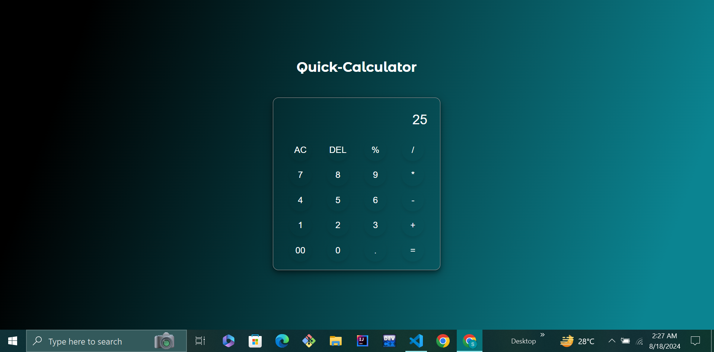

# Vanilla-Web-Projects
This repository contains a collection of web projects created using HTML, CSS, and JavaScript. The purpose of these projects is to practice and enhance my front-end development skills.

## Analog Clock Project
This project is a simple analog clock built using HTML, CSS, and JavaScript. It displays the current time and is fully responsive, adjusting to different screen sizes.
### Features
- Accurate time display
- Customizable clock face
### Installation
1. Clone the repository:
   git clone https://github.com/SabinaRasheed/Vanilla-Web-Project.git

# Calculator Project
This is a simple calculator application built with HTML, CSS, and JavaScript.

## Screenshot

## Features

- Basic arithmetic operations
- Clear (AC) and delete (DEL) functions
- Error handling for invalid expressions
